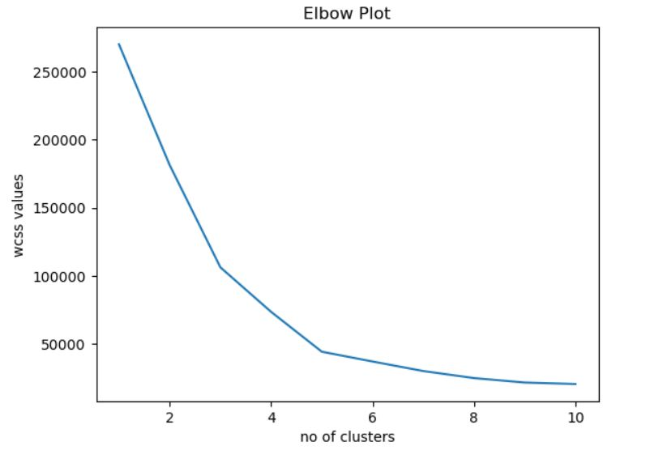

# Customer-Segmentation-using-K-Means-Clustering
<h2>Key Processes</h2>

<h3> 1) Understanding The Data </h3>
        <li>Import Libraries</li> 
        <li>Create and understand Dataframe</li>
        <li>Check null values</li>
        <li>Prepare data for clustering (EDA) if required.</li>
     
<h3> 2) Perform Elbow Method to decide optimal number of clusters </h3>
       <li>Using K-Means to iterate from 1-11 clusters and plotting elbow plot.</li>
     
<h3> 3) Training Model using K-Means Algorithm.</h3>
        <li>Initializing model with optimum number of Clusters</li>
        <li>Plot Clusters and Analyse the plot</li>

<h2>Elbow Plot</h2>

<li>The "elbow" of the curve is the point where the WCSS starts to decrease at a slower rate. Essentially, it's where the decrease in WCSS slows down significantly compared to previous cluster additions.</li>
<li>To determine the optimal number of clusters, look for the point where adding more clusters results in a relatively smaller decrease in WCSS.</li>
<li>Example: If the plot has a noticeable "elbow" at k = 3, it means that adding more clusters beyond k = 3 results in diminishing returns, and thus k = 3 could be the optimal number of clusters.</li>
<li>Example: Here we notice the WCSS decreasing at a slower rate at point 5, which we determine as the "elbow" of our plot. So our optimum number of clusters is 5</li>

<h2>Analysis</h2>

1) Brown Cluster - Customers with low income but spend a lot
2) Blue Cluster  - Customers with high income and spend a lot
3) Magenta Cluster - Customers with low income and spend less
4) Red Cluster - Customers with low high but spend less
5) Purple Cluster - Customers with decent income but spend moderately

<h2>Conclusion</h2>
As the analysis suggests, companies would mostly target customers in the purple cluster as it includes maximum data points indicating that maximum customers lie in this range of income and spending tendencies. Pricing, Marketing strategies etc will mostly be dictated by this segment for best profits.
